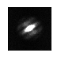
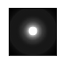
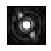

# Фильтрация данных

В этом задании вы будете заниматься фильтрацией данных: расшифровывать закодированный радиосигнал и восстанавливать изображение двойной звезды.

**Дедлайн 28 ноября в 23:55**

1. В файле `wifi.py` загрузите файл с данными из папки `wifi`, названный вашей фамилией. Декодируйте содержимое в ASCII строку и запишите её в файл `wifi.json` в виде `{"message": "Hello"}`. Для кодирования был использован [код Баркера](https://ru.wikipedia.org/wiki/Последовательность_Баркера) длинной 11, причём каждый его элемент повторен 5 раз, таким образом длина кодирующей последовательности равна 55.

2. В файле `speckle.py` обработайте резльутаты спекл-наблюдений.
Файл `speckledata.fits` содержит 101 изображение, полученные при фотографировании двойной звезды с короткой выдержкой.
При наблюдении точечного объекта, коим можно считать одиночную звезду, с помощью наземного телескопа его изображение деформируется по трём причинам — дифракция на апертуре телескопа, рассеяние света в атмосфере и интерференция света на неоднородностях атмосферы.
По последней причине каждое изображение представляет из себя набор «спеклов» — пятнышек интерференционной картины, который имеют размер определяемый остальными двумя эффектами.
Вашей задачей является восстановление изображения [двойной звезды](http://simbad.u-strasbg.fr/simbad/sim-id?Ident=HD9165&submit=submit+id) с помощью его фильтрации в пространстве частот.
Все изображения должны быть сохранены в корневую папку репозитория, иметь размер 512x512 пикселей и хорошо подобранный контраст.
 - Загрузите данные с помощью модуля `astropy.io.fits`:
 ```python
 data = fits.open('speckledata.fits')[2].data
 ```
 - Теперь `data` — это трёхмерный массив, где первое измерение соответствует номеру кадра, а остальные два — картинной плоскости.
 Посмотрите на отдельные кадры, а их среднее нарисуйте сохраните в файл `mean.png`.
 Примерно так выглядело бы изображение объекта при выдержке более ~100 мс.
 - Сделайте двумерное преобразование Фурье каждого кадра и сложите все Фурье-образы.
 Сдвиньте полученный Фурье-образ так, чтобы нулевая частота оказалась в центре кадра, нарисуйте его и сохраните в файл `fourier.png`.
 Если вы подобрали правильный контраст, то должно получиться что-то подобное:
 
 - Теперь нужно очистить Фурье-образ от эффектов, связанных с рассеянием.
 Рассеяние происходит изотропно, а значит является функцией только модуля частоты.
 Создайте набор из ~100 повёрнутых Фурье-образов с помощью функции `scipy.ndimage.rotate` и усредните их.
 Нарисуйте полученный Фурье-образ и сохраните его в файл `rotaver.png`, при правильном контрасте должно получиться что-то похожее на следующее изображение:
 
 Будем считать, что данный Фурье-образ описывает эффекты рассеяния, а значит, по теореме о свёртке, следует поделить образ из предыдущего шага на «образ рассеяния».
 - Самая большая частота, которая всё ещё может нести физическую информацию об объекте соответствует дифракции на апертуре телескопа, а большие частоты связаны с шумом.
 Размер дифракционного изображения в первоначальном пространстве длин составлял бы несколько пикселей.
 Исходя из этого обнулите все частоты, по модулю превосходящие некоторую частоту отсечения, и сделайте обратное преобразование Фурье.
 Подоберие частоту отсечения самостоятельно.
 Теперь центральная часть изображения, при правильном контрасте, будет выглядеть следующим образом:
 
 Сохраните это изображение в файл `binary.png`.
 Подумайте, почему восстановленное изображение двойной звезды так выглядит.
