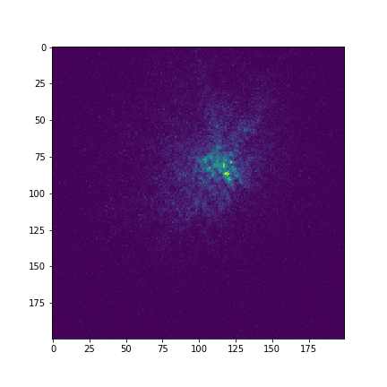
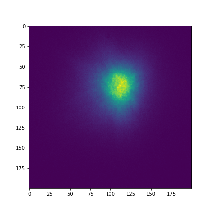

# Домашнее задание № 4

## Фильтрация данных

В этом задании вы будете заниматься фильтрацией данных: расшифровывать закодированный радиосигнал и восстанавливать изображение двойной звезды.

> В геофизике известно, что на масштабах до десятков метров воздух атмосферы Земли постоянно пребывает в турбулентном движении.
> Это означает, что известные из гидродинамики величины, такие как поля скоростей V, плотностей ρ и температур T, становятся теперь случайными полями.
> А значит, требуют описания в терминах статистических характеристик, например аналогичных автокорреляционной функции.
> Следствием случайности поля температуры T является случайность поля оптического показателя преломления n. Как известно, для воздуха n зависит от плотности ρ и температуры T.
>
> На практике, величины этих постоянных пространственно-временных колебаний оптического показателя преломления n таковы, что оказывают принципиальное ограничивающие влияние на наземные оптические астрономические наблюдения. При экспозициях порядка нескольких миллисекунд можно пренебречь эволюцией случайного поля n во времени.
Тогда в телескопе вместо дифракционного изображения бесконечно удаленного точечного источника света (коим является звезда), будет видна интерференционная картина вызванная неоднородностями показателя преломления n в атмосфере Земли. Характерные маленькие зёрна называются спеклами:
>
> 
>
> При длительных экспозициях эта интерференционная картина замывается из-за эволюции во времени и изображение представляет из себя большое пятно:
>
> 
>
> На изображении выше — [двойная двезда HD9165](http://simbad.u-strasbg.fr/simbad/sim-id?Ident=HD9165&submit=submit+id). Кажется, что разрешающая способность телескопа безнадежно испорчена атмосферой, однако, согласно законам оптики, для двух некогерентных точечных источников интерференционная картина на первом изображении должна "двоиться".
> Если бы нам удалось оценить двумерную автокорреляционную функцию мгновенных изображений спеклов, то по расстоянию между пиками мы могли бы оценить расстояние между двумя звездами.
> На подобной идее основан метод [спекл-интерферометрии](http://www.astronet.ru/db/msg/1188685).


**Дедлайн 13 мая в 23:55**

1. В файле `wifi.py` реализуйте программу, которая принимает имя файла с входными данными в качестве единственного аргумента командной строки.
   > Для задания аргументов командной строки в Spyder используйте меню "Запуск" -> "Настройки для файла..." (`Ctrl+F6`) -> "Опции командной строки"

   Известно, что для кодирование сообщения был использован [код Баркера](https://ru.wikipedia.org/wiki/Последовательность_Баркера) длиной 11, причём каждый его элемент повторен 5 раз, таким образом длина кодирующей последовательности равна 55.
   Декодируйте содержимое файла 'hello.dat' в ASCII строку и запишите её в файл `wifi.json` в виде `{"message": "Text"}`.

2. В файле `speckle.py` обработайте резльутаты спекл-наблюдений.
   Файл `speckledata.fits` содержит 101 последовательное изображение, полученные при фотографировании [двойной звезды](http://simbad.u-strasbg.fr/simbad/sim-id?Ident=HD9165&submit=submit+id) с короткой экспозицией.
   Вашей задачей является восстановление изображения двойной звезды с помощью его фильтрации в пространстве частот.
   Все изображения должны быть сохранены в корневую папку репозитория, иметь размер 512x512 пикселей и хорошо подобранный контраст.
    - Загрузить данные можно с помощью модуля `astropy.io.fits`:
    ```python
    data = fits.open('speckledata.fits')[2].data
    ```
    Теперь `data` — это трёхмерный массив, где первое измерение соответствует номеру кадра, а остальные два — картинной плоскости.
    - Самостоятельно вычислите усредненное по времени изображение и сохраните в файл `mean.png`.
    - С помощью быстроного двумерного преобразования Фурье вычислите средний по времени спектр мощности изображений, сохраните его изображение в файл `fourier.png`.
      > Напомним, что спектром мощности случайного процесса называется квадрат модуля его преобразования Фурье.
      > Если вы подобрали правильный контраст, то должно получиться что-то подобное:
      >
      > 
      >
      > Однако перед непосредственным пременением теоремы Винера-Хинчина нужно учесть еще несколько эффектов.
    - Нужно оценить и вычесть из среднего спектра мощности его среднюю шумовую подложку.
      Видно, что изображение среднего спектра мощности условно делится на две части окружностью, радиус которой соответствует так называемой частоте отсечения: внутри окружности частоты ниже, вне — выше. В данном случае частота отсечения примерно соответсвует 50 пикселям. Спектр мощности на частотах выше частоты отсечения в идеальном случае должен был бы быть равным нулю.
      > Для усреднения по всем пикселям вне окружности удобно использовать `np.ma.masked_array`.
    - Нужно учесть эффект рассеяния света в однородной изотроптной атмосфере (обычное молекулярное рассеяние известное из курса оптики).
      Так как рассеяние происходит изотропно и, следовательно, зависит только от модуля вектора пространственной частоты, удобно усреднить спектр мощности по всем углам и использовать результат для последующей нормировки.
      > Для усреднения по углам удобно использовать функцию `scipy.ndimage.rotate` для поворота изображения спектра мощности на углы из некоторой сетки значений, с последующим усреднением полученных изображений. Нарисуйте полученный Фурье-образ и сохраните его в файл `rotaver.png`, при правильном контрасте должно получиться что-то похожее на следующее изображение:
      >
      > 

      Нужно попиксельно разделить спектр мощности на соответсвующий средний по углу спектр мощности.
    - Занулите все частоты выше частоты отсечения и примените обратное двумерное преобразование Фурье
      > Удобно использовать метод `filled(0)` для `np.ma.masked_array`.
      > Теперь центральная часть изображения, при правильном контрасте, будет выглядеть следующим образом:
      >
      > 

      Сохраните это изображение в файл `binary.png`.
3. *Бонусное задание*. В предыдущем задании получилась двумерная автокорреляционная функция состоящая из трех пиков.
   Используя пакет [photutils](https://photutils.readthedocs.io/en/stable/), определите их положения в пикселях,
   и рассчитайте угловое расстояния между компонентами двойной системы в угловых секундах.
   Известно, что масштаб исходного изображения составляет `0.0206` угловых секунды на 1 пиксель.
   > Для фильтрации ложных пиков удобно использовать сортировку по интенсивности пиков

   Результат сохраните в файл `binary.json` в формате `{"distance": 0.123}`.
